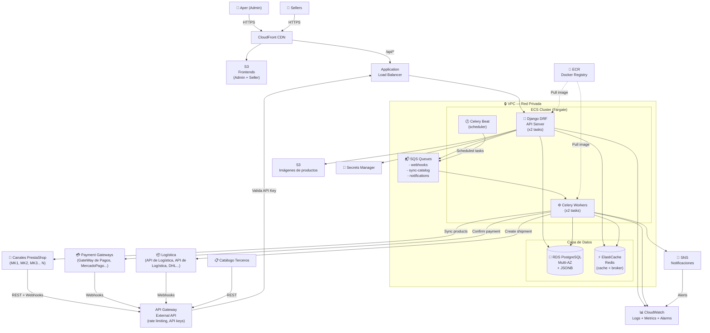

# SellersCenter — Arquitectura del Sistema

**Versión:** 0.1 (Borrador)
**Fecha:** 2026-02-20
**Estado:** En revisión

---

## 1. Visión general

SellersCenter (SC) es un **hub de integración API-first** que centraliza
la comunicación entre múltiples marketplaces, sellers, pasarelas de pago
y sistemas de logística, eliminando las integraciones directas punto-a-punto.

### El problema que resuelve

```
ANTES (N × M integraciones):                DESPUÉS (N + M integraciones):

MK1 (PrestaShop) ──┬──► GateWay de Pagos                  MK1 (PrestaShop) ──┐
                   ├──► API de Logística                     MK2 (PrestaShop)   ├──► SELLERS CENTER ──► GateWay de Pagos
                   └──► API de Logística                MK3 (PrestaShop)   │       (hub único)  ──► API de Logística
MK2 (PrestaShop) ──┬──► GateWay de Pagos                  ...                ┘                   ──► API de Logística
                   ├──► API de Logística                                                            ──► ...
                   └──► API de Logística
...complicado, no escalable...
```

### Actores del sistema

| Actor | Tipo | Descripción |
|-------|------|-------------|
| **Aper** | Humano (admin) | Dueño del sistema. Ve todo, configura todo. |
| **Sellers** | Humano (operador) | Gestiona sus productos, pedidos, precios, stock. |
| **Canales PrestaShop (MKs)** (N) | Sistema propio de Aper | Tiendas PrestaShop de distintos clientes (MK1, MK2, etc.), gestionadas por Aper. Envían pedidos, reciben catálogo. |
| **Payment Gateways** | Sistema externo | GateWay de Pagos, Stripe, MercadoPago. Notifican pagos vía webhook. |
| **Logística** | Sistema externo | API de Logística, API de Logística, DHL. Notifican estado de envíos. |
| **Catálogo de terceros** | Software externo | Sistemas de catálogo que sincronizan productos. |

---

## 2. Decisiones de diseño clave

### API-first con DRF
- Un único backend expone toda la lógica como API REST
- Los frontends (admin + sellers) son clientes como cualquier otro
- Los marketplaces y sistemas externos se integran via API o webhooks

### PostgreSQL + JSONB para catálogo
```sql
CREATE TABLE catalog_product (
    id UUID PRIMARY KEY,
    seller_id UUID REFERENCES sellers(id),
    sku VARCHAR(100) NOT NULL,
    base_name VARCHAR(255),
    base_price DECIMAL(12, 2),
    base_stock INTEGER,
    -- Atributos específicos por marketplace
    marketplace_data JSONB DEFAULT '{}'::jsonb,
    created_at TIMESTAMPTZ DEFAULT NOW()
);

-- Ejemplo de marketplace_data:
-- {
--   "prestashop_mk1": { "id_product": 142, "id_category_default": 5, "active": true },
--   "prestashop_mk2": { "id_product": 87,  "id_category_default": 3, "active": true },
--   "prestashop_mk3": { "id_product": 210, "id_category_default": 8, "active": false }
-- }
```

### Celery para procesamiento asíncrono
Los webhooks de marketplaces/pagos/logística se reciben, se encolan en SQS y
se procesan en background para no bloquear la API.

---

## 3. Arquitectura AWS

### Diagrama



---

## 4. Servicios AWS — justificación

| Servicio | Rol | Justificación |
|----------|-----|---------------|
| **ECS Fargate** | Ejecutar Django + Celery | No gestionar servidores, escala automático, ya tenemos Docker |
| **RDS PostgreSQL Multi-AZ** | Base de datos principal | Managed, backups automáticos, Multi-AZ para HA, soporta JSONB |
| **ElastiCache Redis** | Cache + Celery broker | Managed, sub-ms latency, ideal para sesiones y broker de tareas |
| **SQS** | Cola de mensajes | Desacopla webhooks del procesamiento, reintentos automáticos, DLQ |
| **API Gateway** | API externa | Rate limiting, API keys por marketplace, throttling, logging |
| **ALB** | Load balancer interno | Health checks, distribución de carga entre tasks ECS |
| **CloudFront + S3** | Frontends estáticos | CDN global, bajo costo, alta disponibilidad |
| **S3 (media)** | Imágenes de productos | Escalable, integrado con CloudFront para entrega rápida |
| **Secrets Manager** | Secretos y API keys | Rotación automática, acceso fine-grained por IAM |
| **CloudWatch** | Observabilidad | Logs centralizados, métricas, alarmas, dashboards |
| **ECR** | Registro de imágenes Docker | Integrado con ECS, escaneo de vulnerabilidades |
| **SNS** | Notificaciones | Fan-out de alertas a email/Slack/PagerDuty |

---

## 5. Dominio del sistema — Módulos Django

```
src/apps/
├── accounts/          # Auth, usuarios, roles (Aper, Seller, API user)
├── sellers/           # Gestión de sellers, perfiles, configuración
├── catalog/           # Productos, variantes, JSONB por marketplace
├── channels/          # Adaptadores por canal PrestaShop (Adapter pattern)
│   ├── adapters/
│   │   ├── prestashop.py      # Adaptador genérico PrestaShop (reutilizado por todos los clientes)
│   │   └── prestashop_auth.py # Gestión de API keys por instancia
├── orders/            # Pedidos, ítems, estados, timeline
├── payments/          # Transacciones, integración con gateways
├── logistics/         # Envíos, tracking, providers
├── webhooks/          # Recepción y encolado de webhooks externos
├── notifications/     # Notificaciones a sellers y admins
└── core/              # Utilidades compartidas, base models
```

### Modelo de datos central (simplificado)

```
Seller (1) ──────── (N) Product
                         │
                         ├── ProductVariant (talle, color...)
                         └── ChannelListing (1 por marketplace)
                              ├── status: active/paused/error
                              ├── price_override: decimal
                              └── marketplace_data: JSONB

Marketplace (1) ──── (N) Order
Order (1) ──────────── (N) OrderItem ──── ProductVariant
Order (1) ──────────── (1) Payment
Order (1) ──────────── (1) Shipment
```

---

## 6. Flujo de datos — casos de uso clave

### 6.1 Un marketplace recibe un pedido
```
Marketplace → POST /api/webhooks/orders/ (API Gateway)
    → API Gateway valida API Key del marketplace
    → SQS queue: "incoming-orders"
    → Celery Worker procesa:
        1. Normaliza el pedido (formato SC)
        2. Identifica seller y productos
        3. Registra Order + OrderItems en RDS
        4. Notifica al seller (SNS → email/push)
        5. Confirma al marketplace (HTTP callback)
```

### 6.2 Seller actualiza precio de un producto
```
Seller → PUT /api/catalog/products/{id}/pricing/ (CloudFront → ALB)
    → DRF verifica permisos (solo su catálogo)
    → Actualiza RDS
    → Encola en SQS: "sync-channel-listings"
    → Celery Workers (en paralelo por canal):
        - Adapter PrestaShop MK1 → actualiza precio vía PrestaShop API
        - Adapter PrestaShop MK2 → actualiza precio vía PrestaShop API
        - Adapter PrestaShop MK3 → actualiza precio vía PrestaShop API
    → Registra resultado (success/error) por canal
```

### 6.3 Gateway confirma pago
```
GateWay de Pagos → POST /api/webhooks/payments/ (API Gateway)
    → Valida firma del webhook (HMAC)
    → SQS queue: "payment-confirmations"
    → Celery Worker:
        1. Actualiza Order.status = PAID
        2. Notifica logística para preparar envío
        3. Notifica seller
        4. Actualiza estadísticas financieras
```

---

## 7. Seguridad

| Capa | Medida |
|------|--------|
| Red | VPC con subnets privadas para RDS, Redis, Workers |
| API externa | API Gateway con API Keys por marketplace + WAF |
| Autenticación humana | JWT (SimpleJWT) para sellers y admins |
| Webhooks externos | Validación de firma HMAC por provider |
| Secretos | Secrets Manager (DB password, API keys de marketplaces) |
| IAM | Roles separados por servicio (ECS Task Role mínimo privilegio) |
| Datos | RDS encriptado at-rest, TLS en tránsito |
| Imágenes | ECR con escaneo de vulnerabilidades habilitado |

---

## 8. Estimación de costos (ambiente development)

| Servicio | Tier | Costo/mes aprox. |
|---------|------|-----------------|
| ECS Fargate (2 tasks API + 2 Worker) | 0.25 vCPU / 0.5GB cada uno | ~$15 |
| RDS PostgreSQL t3.micro | Single-AZ dev | ~$15 |
| ElastiCache Redis t3.micro | Single node dev | ~$15 |
| ALB | Por hora + LCU | ~$20 |
| API Gateway | 1M requests/mes gratis | ~$0 |
| S3 + CloudFront | Primeros 50GB gratis | ~$2 |
| SQS | 1M requests gratis/mes | ~$0 |
| CloudWatch Logs | 5GB gratis | ~$0-5 |
| **Total estimado (dev)** | | **~$70/mes** |

**Producción (Multi-AZ, más capacidad):** ~$200-400/mes según carga.

---

## 9. Próximos pasos

### Sprint 1 — Base (2 semanas)
- [ ] Estructura Django con Docker Compose local
- [ ] Modelos: Seller, Product, Channel, Order
- [ ] Auth con SimpleJWT
- [ ] API básica: CRUD catálogo
- [ ] Tests unitarios con pytest

### Sprint 2 — Integración (2 semanas)
- [ ] Adapter patrón para PrestaShop (1 instancia piloto)
- [ ] Recepción de webhooks + SQS local (LocalStack)
- [ ] Celery + Redis para procesamiento async
- [ ] Sync bidireccional de productos

### Sprint 3 — AWS (2 semanas)
- [ ] CDK stack: VPC + ECS + RDS + Redis
- [ ] Pipeline CI/CD (GitHub Actions → ECR → ECS)
- [ ] Secrets Manager integración
- [ ] CloudWatch dashboards

### Sprint 4 — Frontends (2 semanas)
- [ ] Admin dashboard (React o Django templates)
- [ ] Seller portal
- [ ] Deploy en S3 + CloudFront
